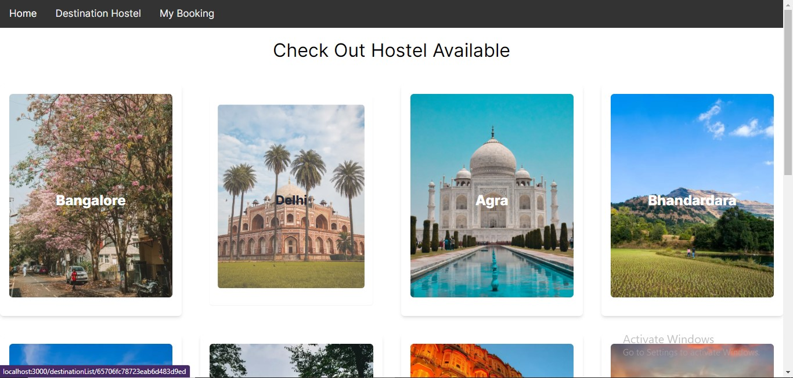
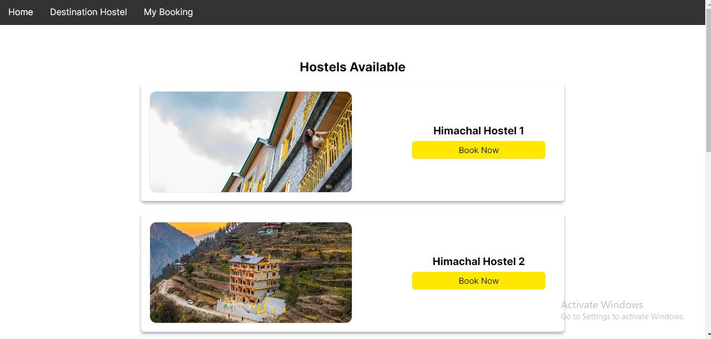
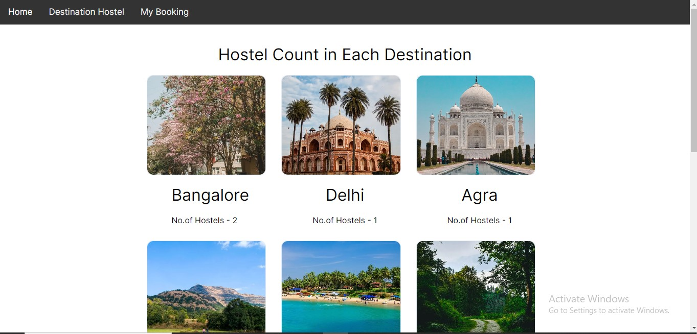
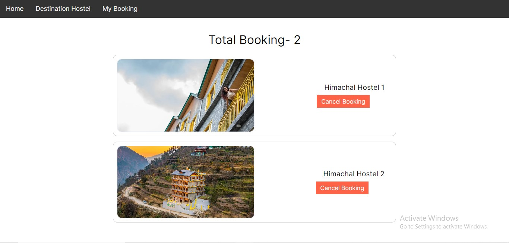

# Hosteller_Assignment


## Table of Contents

- [How to Start the App](#how-to-start-the-app)
- [Backend Server](#backend-server)
- [Frontend Server](#frontend-server)
- [Screenshots](#screenshots)
  - [Home Page](#home-page)
  - [Hostel At Destination](#hostel-at-destination)
  - [Each Destination Hostel Count](#each-destination-hostel-count)
  - [My Booking](#my-booking)
- [App Functionality](#app-functionality)
  - [Book Hostel](#book-hostel)
  - [Remove Booking](#remove-booking)
  - [Responsiveness](#responsiveness)
  - [Redux Store](#reduc-store)
- [Tech Stack](#tech-stack)

## How to Start the App

This App Uses NextJs 14.0.3 , which itself doesn't require ExpressJs for setting up backend server , but for the first learning process I have utilized ExpressJs & GraphQl to create the 
Apollo Server and separate for backend and Frontend

## Backend Server

1. Clone the repository:

   ```bash
   git clone https://github.com/GaneshYadav3142/Hosteller_Assignment.git

2. Move to server directory: 
   
   ```bash
   cd server

3. Install Necessary Dependencies: 

    ```bash
   npm install

4. Start the backend server ,the app will run on port 4000:

    ```bash
    npm run server
    
## Frontend Server

1. Open the another terminal, move to client directory:

   ```bash
  cd client

2. Move to my-app: 
   
   ```bash
   cd my-app

3. Install Necessary Dependencies: 

    ```bash
   npm install

4. Start the Frontend server ,the app will run on port 3000,with http://localhost:3000:

    ```bash
    npm run dev

## Screenshots

### Homepage (Page 1)



### Hostel At Destination (Page 2)



### Each Destination Hostel Count (Page 3)



### My Booking




## App Functionality

1. These app is Fully Responsive to all Screens available:

2. You can Check the Hostel Available at each destination by clciking on the Destination:

3. Further You can Book the particular hostel based on destination

4. You Can also check the Count of Hostel present at Each Destination by visiting, Destination Hostel

5. Further You can remove the added Hostel , from you Booking section


6. Data such as booked hostel  is stored in the redux store.


## Tech Stack

The app is built using the following technologies:

Backend
1. GraphQl with ApolloServer and ExpressJS:
2. MongoDB as Database management:

Frontend
1. NextJS 14.0.3 @latest
2. React-Redux
3. ApolloClient for fetching query at Forntend
4. CSS3
5. Tailwind for extra styling effect
